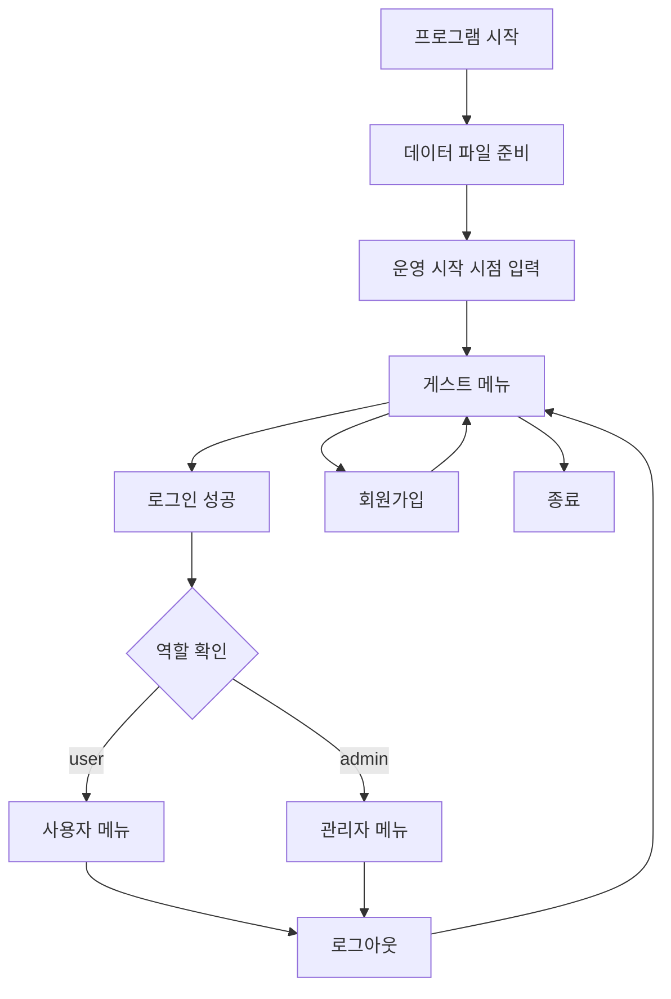
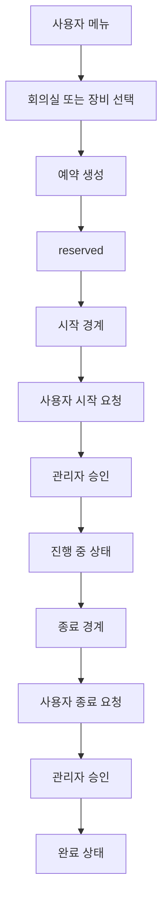
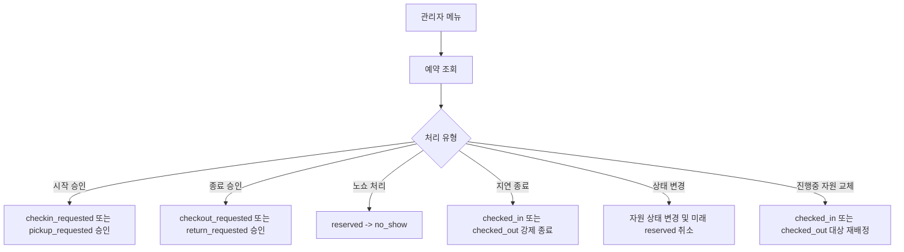

# KUWorkspace 정책 및 동작 명세서

이 문서는 현재 코드베이스를 기준으로 KUWorkspace CLI 프로그램의 데이터 요소, 저장 형식, 입력 문법, 의미 규칙, 상태 전이, 사용자 흐름, 관리자 처리 규칙을 정리한 명세 문서이다. 본 문서는 `PLAN.md`와 같은 기획 초안이 아니라 실제 구현된 코드의 동작을 기준으로 작성한다.

## 목차

1. [용어](#1-용어)
2. [기본 사항](#2-기본-사항)
3. [사용 흐름도](#3-사용-흐름도)
4. [데이터 요소](#4-데이터-요소)
5. [데이터 파일](#5-데이터-파일)
6. [주 프롬프트 및 규칙](#6-주-프롬프트-및-규칙)
7. [정책 규칙 요약](#7-정책-규칙-요약)
8. [미정 정책 또는 해석상 주의사항](#8-미정-정책-또는-해석상-주의사항)

## 1. 용어

- 프로그램: 이 문서에서 명세하는 대상 CLI 프로그램 전체를 의미한다.
- 운영 시계: 실제 벽시계 대신 프로그램이 사용하는 세션 단위 가상 시계다.
- 슬롯: 운영 시계가 가질 수 있는 허용 시각 단위다. 현재 구현에서는 `09:00`, `18:00` 두 값만 사용한다.
- 게스트: 로그인하지 않은 사용자 상태다.
- 일반 사용자: `user` 역할을 가진 로그인 사용자다.
- 관리자: `admin` 역할을 가진 로그인 사용자다.
- 자원: 회의실과 장비 자산을 통칭한다.
- 활성 예약: 충돌 판정과 예약 한도 계산에서 유효한 예약 상태를 가진 예약이다.
- 예약 시작 경계: 예약의 `start_time`과 현재 운영 시점이 정확히 일치하는 시점이다.
- 예약 종료 경계: 예약의 `end_time`과 현재 운영 시점이 정확히 일치하는 시점이다.
- 제한 사용자: 누적 패널티가 제한 기준 이상이면서 `restriction_until`이 현재보다 뒤인 사용자다.
- 금지 사용자: 누적 패널티가 이용 금지 기준 이상이면서 `restriction_until`이 현재보다 뒤인 사용자다.
- 노쇼: 시작 경계 시점에 사용자가 이용 시작 요청을 하지 않은 상태로 남아 관리자가 `no_show`로 처리한 예약이다.
- 지연 종료: 종료 경계 시점에 사용자가 종료 요청을 하지 않은 상태로 남아 관리자가 강제 종료 처리한 예약이다.
- 관리자 취소: 관리자가 `reserved` 상태 예약을 취소하거나, 시스템 정책에 의해 미래 예약이 자동 취소되어 `admin_cancelled`가 된 상태다.
- 문의/신고 메시지: 사용자가 제출하는 단문 메시지다. 유형은 `inquiry`, `report` 두 가지다.
- JSON Lines: 파일의 각 줄이 독립적인 JSON 객체인 저장 형식이다.
- 전역 락: 다중 쓰기 경로를 직렬화하기 위해 `data/.lock` 파일을 사용하는 잠금 방식이다.
- `UnitOfWork`: 여러 파일을 한 번에 원자적으로 커밋하기 위한 쓰기 트랜잭션 단위다.

## 2. 기본 사항

### 2.1 작동 환경

- 프로그램은 Python 기반 CLI 애플리케이션이다.
- 로컬 파일 시스템을 전제로 동작한다.
- 데이터베이스를 사용하지 않는다.
- 프로그램은 저장소 루트의 `data/` 디렉터리에 있는 텍스트 파일을 영속 저장소로 사용한다.

### 2.2 프로그램 구성

- 최상위 진입점은 `main.py`다.
- 주요 레이어는 다음과 같다.

| 레이어 | 역할 |
| --- | --- |
| CLI 레이어 | 메뉴 출력, 입력 수집, 확인/취소 흐름 처리 |
| 도메인 서비스 레이어 | 인증, 예약, 정책 점검, 패널티, 메시지 처리 |
| 저장소 레이어 | JSON Lines 파일 읽기/쓰기, 충돌 조회, append-only 처리 |
| 런타임 시계 레이어 | 운영 시점 유지, 다음 슬롯 계산 |

### 2.3 프로그램 시작과 초기화

프로그램은 다음 순서로 시작한다.

1. `data/` 디렉터리와 필요한 데이터 파일을 준비한다.
2. 운영 시작 시점을 입력받는다.
3. 입력된 시작 시점으로 활성 운영 시계를 설정한다.
4. 게스트 메뉴로 진입한다.

초기화 시 자동 생성 대상 데이터 파일은 다음과 같다.

- `users.txt`
- `rooms.txt`
- `equipment_assets.txt`
- `room_bookings.txt`
- `equipment_bookings.txt`
- `penalties.txt`
- `audit_log.txt`
- `message.txt`

### 2.4 운영 시계

- 운영 시계는 세션 메모리 기반이다.
- 운영 시점은 `09:00`, `18:00`만 허용된다.
- 다음 슬롯 계산 규칙은 다음과 같다.

| 현재 시점 | 다음 시점 |
| --- | --- |
| `YYYY-MM-DD 09:00` | 같은 날 `18:00` |
| `YYYY-MM-DD 18:00` | 다음 날 `09:00` |

- 프로그램 시작 시 입력하는 시작 날짜 형식은 `YYYY-MM-DD`다.
- 시작 슬롯은 `09:00` 또는 `18:00`만 허용된다.
- 입력한 시작 시점은 기존 데이터에 저장된 가장 최신 시각보다 빠를 수 없다.

### 2.5 역할 체계

| 역할 | 영문 값 | 설명 |
| --- | --- | --- |
| 일반 사용자 | `user` | 예약, 요청, 문의/신고, 상태 조회 수행 |
| 관리자 | `admin` | 승인, 노쇼 처리, 강제 종료, 상태 변경, 사용자 조회 수행 |

### 2.6 저장소 구성

| 파일 | 대응 도메인 요소 | 저장 방식 |
| --- | --- | --- |
| `users.txt` | `User` | 전체 파일 재저장 |
| `rooms.txt` | `Room` | 전체 파일 재저장 |
| `equipment_assets.txt` | `EquipmentAsset` | 전체 파일 재저장 |
| `room_bookings.txt` | `RoomBooking` | 전체 파일 재저장 |
| `equipment_bookings.txt` | `EquipmentBooking` | 전체 파일 재저장 |
| `penalties.txt` | `Penalty` | append-only |
| `audit_log.txt` | `AuditLog` | append-only |
| `message.txt` | `Message` | append-only |

## 3. 사용 흐름도

### 3.1 전체 상위 흐름

### 3.2 일반 사용자 예약 흐름

### 3.3 관리자 처리 흐름

## 4. 데이터 요소

본 절은 현재 구현된 모든 영속 도메인 객체를 기준으로 작성한다.

### 4.1 사용자 계정 요소

대상 모델: `User`

| 필드 | 저장 타입 | 허용값/형식 | 의미 규칙 |
| --- | --- | --- | --- |
| `id` | `str` | UUID 문자열 | 사용자 고유 식별자 |
| `username` | `str` | 3~20자, 영문/숫자/`_` | 로그인 ID, 공백 trim 후 저장 |
| `password` | `str` | 4~50자 | 평문 저장 |
| `role` | `str` enum | `user`, `admin` | 역할 구분 |
| `penalty_points` | `int` | 0 이상 | 현재 누적 패널티 점수 |
| `normal_use_streak` | `int` | 0 이상 | 연속 정상 이용 횟수 |
| `restriction_until` | `str \| null` | ISO datetime | 제한 또는 금지 해제 시각 |
| `created_at` | `str` | ISO datetime | 계정 생성 시각 |
| `updated_at` | `str` | ISO datetime | 마지막 갱신 시각 |

의미 규칙:

- `username`은 저장 전 앞뒤 공백을 제거한다.
- `username`은 중복될 수 없다.
- `restriction_until`은 점수 자체가 아니라 제한 기간의 유효 여부를 나타낸다.
- 제한/금지 여부는 `penalty_points`와 `restriction_until`을 함께 해석해 계산한다.

### 4.2 회의실 요소

대상 모델: `Room`

| 필드 | 저장 타입 | 허용값/형식 | 의미 규칙 |
| --- | --- | --- | --- |
| `id` | `str` | UUID 문자열 | 회의실 고유 식별자 |
| `name` | `str` | 자유 텍스트 | 화면 표시 이름 |
| `capacity` | `int` | 1 이상 | 최대 수용 인원 |
| `location` | `str` | 자유 텍스트 | 위치 설명 |
| `status` | `str` enum | `available`, `maintenance`, `disabled` | 운영 상태 |
| `description` | `str` | 자유 텍스트 | 부가 설명 |
| `created_at` | `str` | ISO datetime | 생성 시각 |
| `updated_at` | `str` | ISO datetime | 갱신 시각 |

의미 규칙:

- `status`가 `available`일 때만 신규 예약 대상이 된다.
- 실제 점유 여부는 `Room.status`로 저장하지 않고 예약 상태와 현재 시각으로 계산한다.

### 4.3 장비 자산 요소

대상 모델: `EquipmentAsset`

| 필드 | 저장 타입 | 허용값/형식 | 의미 규칙 |
| --- | --- | --- | --- |
| `id` | `str` | UUID 문자열 | 장비 고유 식별자 |
| `name` | `str` | 자유 텍스트 | 장비 이름 |
| `asset_type` | `str` | 자유 텍스트 | 장비 종류, 예: 노트북, 프로젝터 |
| `serial_number` | `str` | 자유 텍스트 | 시리얼 번호 |
| `status` | `str` enum | `available`, `maintenance`, `disabled` | 운영 상태 |
| `description` | `str` | 자유 텍스트 | 부가 설명 |
| `created_at` | `str` | ISO datetime | 생성 시각 |
| `updated_at` | `str` | ISO datetime | 갱신 시각 |

의미 규칙:

- 장비는 종류가 아니라 개별 자산 단위로 예약된다.
- 같은 `asset_type`이라도 각각 독립된 ID와 독립된 충돌 판정을 가진다.

### 4.4 회의실 예약 요소

대상 모델: `RoomBooking`

| 필드 | 저장 타입 | 허용값/형식 | 의미 규칙 |
| --- | --- | --- | --- |
| `id` | `str` | UUID 문자열 | 예약 고유 식별자 |
| `user_id` | `str` | 기존 `User.id` | 예약자 |
| `room_id` | `str` | 기존 `Room.id` | 예약 대상 회의실 |
| `start_time` | `str` | ISO datetime | 예약 시작 시각 |
| `end_time` | `str` | ISO datetime | 예약 종료 시각 |
| `status` | `str` enum | 아래 상태표 참조 | 현재 예약 상태 |
| `checked_in_at` | `str \| null` | ISO datetime | 관리자 체크인 승인 시각 |
| `requested_checkin_at` | `str \| null` | ISO datetime | 사용자 체크인 요청 시각 |
| `requested_checkout_at` | `str \| null` | ISO datetime | 사용자 퇴실 신청 시각 |
| `completed_at` | `str \| null` | ISO datetime | 종료 완료 시각 |
| `cancelled_at` | `str \| null` | ISO datetime | 취소 시각 |
| `created_at` | `str` | ISO datetime | 생성 시각 |
| `updated_at` | `str` | ISO datetime | 갱신 시각 |

회의실 예약 상태값:

| 한국어 | 영문 값 | 의미 |
| --- | --- | --- |
| 예약 확정 | `reserved` | 생성 직후 상태 |
| 체크인 요청 | `checkin_requested` | 사용자가 시작 요청을 남긴 상태 |
| 체크인 완료 | `checked_in` | 관리자가 시작 승인을 완료한 상태 |
| 퇴실 요청 | `checkout_requested` | 사용자가 종료 요청을 남긴 상태 |
| 이용 완료 | `completed` | 종료가 정상 또는 강제로 완료된 상태 |
| 사용자 취소 | `cancelled` | 사용자가 취소한 상태 |
| 노쇼 | `no_show` | 관리자가 노쇼 처리한 상태 |
| 관리자 취소 | `admin_cancelled` | 관리자 또는 시스템이 취소한 상태 |

상태 전이 규칙:

| 현재 상태 | 이벤트 | 다음 상태 |
| --- | --- | --- |
| 없음 | 예약 생성 | `reserved` |
| `reserved` | 사용자 체크인 요청 | `checkin_requested` |
| `checkin_requested` | 관리자 체크인 승인 | `checked_in` |
| `checked_in` | 사용자 퇴실 신청 | `checkout_requested` |
| `checkout_requested` | 관리자 퇴실 승인 | `completed` |
| `checked_in` | 관리자 지연 종료 처리 | `completed` |
| `reserved` | 사용자 취소 | `cancelled` |
| `reserved` | 관리자 취소 또는 시스템 취소 | `admin_cancelled` |
| `reserved` | 관리자 노쇼 처리 | `no_show` |

의미 규칙:

- 일일 예약 UI로 생성되는 예약은 항상 `시작일 09:00`, `종료일 18:00`으로 저장된다.
- 충돌 판정 대상 상태는 `reserved`, `checkin_requested`, `checked_in`, `checkout_requested`다.

### 4.5 장비 예약 요소

대상 모델: `EquipmentBooking`

| 필드 | 저장 타입 | 허용값/형식 | 의미 규칙 |
| --- | --- | --- | --- |
| `id` | `str` | UUID 문자열 | 예약 고유 식별자 |
| `user_id` | `str` | 기존 `User.id` | 예약자 |
| `equipment_id` | `str` | 기존 `EquipmentAsset.id` | 예약 대상 장비 자산 |
| `start_time` | `str` | ISO datetime | 예약 시작 시각 |
| `end_time` | `str` | ISO datetime | 예약 종료 시각 |
| `status` | `str` enum | 아래 상태표 참조 | 현재 예약 상태 |
| `checked_out_at` | `str \| null` | ISO datetime | 관리자 대여 시작 승인 시각 |
| `requested_pickup_at` | `str \| null` | ISO datetime | 사용자 픽업 요청 시각 |
| `requested_return_at` | `str \| null` | ISO datetime | 사용자 반납 신청 시각 |
| `returned_at` | `str \| null` | ISO datetime | 반납 완료 시각 |
| `cancelled_at` | `str \| null` | ISO datetime | 취소 시각 |
| `created_at` | `str` | ISO datetime | 생성 시각 |
| `updated_at` | `str` | ISO datetime | 갱신 시각 |

장비 예약 상태값:

| 한국어 | 영문 값 | 의미 |
| --- | --- | --- |
| 예약 확정 | `reserved` | 생성 직후 상태 |
| 픽업 요청 | `pickup_requested` | 사용자가 시작 요청을 남긴 상태 |
| 대여 중 | `checked_out` | 관리자가 시작 승인을 완료한 상태 |
| 반납 요청 | `return_requested` | 사용자가 종료 요청을 남긴 상태 |
| 반납 완료 | `returned` | 종료가 정상 또는 강제로 완료된 상태 |
| 사용자 취소 | `cancelled` | 사용자가 취소한 상태 |
| 노쇼 | `no_show` | 관리자가 노쇼 처리한 상태 |
| 관리자 취소 | `admin_cancelled` | 관리자 또는 시스템이 취소한 상태 |

상태 전이 규칙:

| 현재 상태 | 이벤트 | 다음 상태 |
| --- | --- | --- |
| 없음 | 예약 생성 | `reserved` |
| `reserved` | 사용자 픽업 요청 | `pickup_requested` |
| `pickup_requested` | 관리자 대여 시작 승인 | `checked_out` |
| `checked_out` | 사용자 반납 신청 | `return_requested` |
| `return_requested` | 관리자 반납 승인 | `returned` |
| `checked_out` | 관리자 지연 반납 처리 | `returned` |
| `reserved` | 사용자 취소 | `cancelled` |
| `reserved` | 관리자 취소 또는 시스템 취소 | `admin_cancelled` |
| `reserved` | 관리자 노쇼 처리 | `no_show` |

의미 규칙:

- 장비 충돌은 같은 장비 ID 기준으로 판정한다.
- 충돌 판정 대상 상태는 `reserved`, `pickup_requested`, `checked_out`, `return_requested`다.

### 4.6 패널티 요소

대상 모델: `Penalty`

| 필드 | 저장 타입 | 허용값/형식 | 의미 규칙 |
| --- | --- | --- | --- |
| `id` | `str` | UUID 문자열 | 패널티 고유 식별자 |
| `user_id` | `str` | 기존 `User.id` | 대상 사용자 |
| `reason` | `str` enum | `no_show`, `late_cancel`, `late_return`, `damage`, `contamination`, `other` | 패널티 사유 |
| `points` | `int` | 1 이상 | 부여 점수 |
| `related_type` | `str` | `room_booking`, `equipment_booking` | 관련 객체 유형 |
| `related_id` | `str` | 관련 예약 ID | 관련 객체 식별자 |
| `memo` | `str` | 자유 텍스트 | 사유 설명 |
| `created_at` | `str` | ISO datetime | 생성 시각 |
| `updated_at` | `str \| null` | ISO datetime | 갱신 시각 |

의미 규칙:

- `Penalty`는 append-only 기록이다.
- 점수는 `User.penalty_points`에 누적 반영되며 별도 계산 규칙도 함께 적용된다.

### 4.7 감사 로그 요소

대상 모델: `AuditLog`

| 필드 | 저장 타입 | 허용값/형식 | 의미 규칙 |
| --- | --- | --- | --- |
| `id` | `str` | UUID 문자열 | 로그 식별자 |
| `actor_id` | `str` | 사용자 ID 또는 `system` | 수행자 |
| `action` | `str` | 자유 텍스트 | 수행 액션명 |
| `target_type` | `str` | 자유 텍스트 | 대상 유형 |
| `target_id` | `str` | 자유 텍스트 | 대상 식별자 |
| `details` | `str` | 자유 텍스트 | 추가 정보 |
| `created_at` | `str` | ISO datetime | 생성 시각 |
| `updated_at` | `str \| null` | ISO datetime | 갱신 시각 |

의미 규칙:

- `AuditLog`는 append-only 기록이다.
- 시점 이동 성공, 시점 이동 차단, 예약 생성/변경/취소, 패널티 부여, 자원 상태 변경 등 주요 상태 변화는 감사 로그에 남는다.

### 4.8 문의/신고 메시지 요소

대상 모델: `Message`

| 필드 | 저장 타입 | 허용값/형식 | 의미 규칙 |
| --- | --- | --- | --- |
| `user_id` | `str` | 기존 `User.id` | 제출 사용자 |
| `type` | `str` enum | `inquiry`, `report` | 메시지 유형 |
| `content` | `str` | 1~100자, 줄바꿈 불가 | 메시지 본문 |
| `id` | `str` | UUID 문자열 | 메시지 식별자 |
| `created_at` | `str` | ISO datetime | 생성 시각 |

메시지 유형:

| 한국어 | 영문 값 | 의미 |
| --- | --- | --- |
| 문의 | `inquiry` | 일반 문의 |
| 신고 | `report` | 문제 신고 |

의미 규칙:

- 내용은 비어 있을 수 없다.
- 줄바꿈 문자를 포함할 수 없다.
- 공백만으로 구성될 수 없다.
- 길이는 1~100자다.
- 메시지는 append-only다.

## 5. 데이터 파일

### 5.1 문법 규칙

- 모든 데이터 파일은 JSON Lines 형식을 사용한다.
- 한 줄은 정확히 하나의 JSON 객체다.
- 빈 줄은 의미 있는 레코드가 아니다.
- enum 필드는 문자열 원값으로 저장된다.
- 시간은 ISO datetime 문자열로 저장된다.
- `null` 가능 필드는 JSON `null`로 저장된다.

### 5.2 파일별 역할

#### 5.2.1 `users.txt`

- 저장 단위: `User`
- 역할: 사용자 계정, 역할, 누적 패널티, 정상 이용 연속 횟수, 제한 종료 시각 저장
- 저장 유형: 전체 파일 재저장

#### 5.2.2 `rooms.txt`

- 저장 단위: `Room`
- 역할: 회의실 메타데이터와 운영 상태 저장
- 저장 유형: 전체 파일 재저장

#### 5.2.3 `equipment_assets.txt`

- 저장 단위: `EquipmentAsset`
- 역할: 장비 자산 메타데이터와 운영 상태 저장
- 저장 유형: 전체 파일 재저장

#### 5.2.4 `room_bookings.txt`

- 저장 단위: `RoomBooking`
- 역할: 회의실 예약 상태, 기간, 요청/완료 시각 저장
- 저장 유형: 전체 파일 재저장

#### 5.2.5 `equipment_bookings.txt`

- 저장 단위: `EquipmentBooking`
- 역할: 장비 예약 상태, 기간, 요청/완료 시각 저장
- 저장 유형: 전체 파일 재저장

#### 5.2.6 `penalties.txt`

- 저장 단위: `Penalty`
- 역할: 패널티 이력 저장
- 저장 유형: append-only

#### 5.2.7 `audit_log.txt`

- 저장 단위: `AuditLog`
- 역할: 정책 처리 및 상태 변경 이력 저장
- 저장 유형: append-only

#### 5.2.8 `message.txt`

- 저장 단위: `Message`
- 역할: 사용자 문의/신고 메시지 저장
- 저장 유형: append-only

### 5.3 무결성 확인 및 처리

#### 5.3.1 읽기 규칙

- 단순 조회는 전역 락 없이 수행할 수 있다.
- 조회 시 현재 파일 내용 그대로를 사용한다.

#### 5.3.2 쓰기 규칙

- 모든 쓰기 작업은 전역 락 아래에서 수행해야 한다.
- 다중 파일 변경은 `UnitOfWork`로 스테이징한 뒤 최외곽 종료 시점에 한 번에 커밋한다.
- 직접 저장 시에는 임시 파일에 쓴 뒤 원자적으로 교체한다.

#### 5.3.3 예약 충돌 판정 규칙

- 회의실 충돌 판정 상태: `reserved`, `checkin_requested`, `checked_in`, `checkout_requested`
- 장비 충돌 판정 상태: `reserved`, `pickup_requested`, `checked_out`, `return_requested`
- 겹침 판정은 시간 구간이 완전히 분리되지 않으면 충돌로 본다.

#### 5.3.4 append-only 파일 규칙

- `penalties.txt`, `audit_log.txt`, `message.txt`는 기존 레코드를 수정하지 않고 뒤에 추가하는 방식으로 사용한다.

#### 5.3.5 미래 예약 자동 취소 규칙

- 자원 상태가 `maintenance` 또는 `disabled`로 바뀌면 미래 `reserved` 예약만 `admin_cancelled`로 전환한다.
- 누적 점수 6점 이상 사용자의 미래 `reserved` 예약도 정책 점검 시 `admin_cancelled`로 전환한다.

## 6. 주 프롬프트 및 규칙

본 절은 사용자 또는 관리자가 CLI에서 실제로 거치는 입력 흐름을 기준으로 작성한다.

### 6.1 게스트 메뉴

메뉴 항목:

- `1. 로그인`
- `2. 회원가입`
- `9. 운영 시계`
- `0. 종료`

입력 규칙:

- 선택 입력은 숫자 문자열이다.
- 잘못된 메뉴 번호 입력 시 오류 메시지를 출력한다.
- 운영 시계 메뉴는 조회만 가능하다.
- 종료는 확인 입력을 한 번 더 요구한다.

### 6.2 회원가입

입력 순서:

1. 사용자명 입력
2. 비밀번호 입력
3. 비밀번호 확인 입력

검증 규칙:

- 사용자명은 trim 후 검사한다.
- 공백만 입력할 수 없다.
- 길이는 3~20자다.
- 영문, 숫자, `_`만 허용한다.
- 비밀번호는 trim 후 검사한다.
- 공백만 입력할 수 없다.
- 길이는 4~50자다.
- 비밀번호 확인과 일치해야 한다.
- 중복 사용자명은 허용하지 않는다.

실패 시 처리:

- 조건을 만족하지 않으면 해당 단계에서 오류 메시지를 출력하고 재입력한다.
- 회원가입 서비스에서 중복 또는 검증 실패 예외가 발생하면 오류를 출력하고 메뉴로 돌아간다.

성공 시 상태 변화:

- `User` 레코드가 새로 생성된다.
- 기본 역할은 `user`다.

#### 6.2.1 회원가입 예외

- 빈 사용자명
- 너무 짧거나 긴 사용자명
- 허용되지 않은 문자 포함 사용자명
- 빈 비밀번호
- 너무 짧거나 긴 비밀번호
- 비밀번호 확인 불일치
- 이미 존재하는 사용자명

### 6.3 로그인

입력 순서:

1. 사용자명 입력
2. 비밀번호 입력

검증 규칙:

- 두 필드 모두 필수다.
- 입력 전후 공백은 제거된다.
- 존재하는 사용자명과 일치하는 평문 비밀번호가 필요하다.

실패 시 처리:

- 사용자명 또는 비밀번호 누락 시 즉시 오류를 출력한다.
- 존재하지 않는 사용자거나 비밀번호가 일치하지 않으면 로그인 실패다.
- 로그인 후 정책 점검에 실패하면 로그인 세션으로 진입하지 않는다.

성공 시 상태 변화:

- 로그인 사용자가 역할별 메뉴로 이동한다.
- 로그인 직후 현재 패널티 상태 경고 메시지가 출력될 수 있다.

#### 6.3.1 로그인 예외

- 빈 사용자명
- 빈 비밀번호
- 존재하지 않는 사용자
- 비밀번호 불일치
- 정책 점검 중 오류

### 6.4 사용자 메뉴

메뉴 항목:

- `[회의실]`
- `1. 회의실 목록 조회`
- `2. 회의실 예약하기`
- `3. 내 회의실 예약 조회`
- `4. 회의실 예약 변경`
- `5. 회의실 예약 취소`
- `6. 회의실 체크인 요청`
- `7. 회의실 퇴실 신청`
- `[장비]`
- `8. 장비 목록 조회`
- `9. 장비 예약하기`
- `10. 내 장비 예약 조회`
- `11. 장비 예약 변경`
- `12. 장비 예약 취소`
- `13. 장비 픽업 요청`
- `14. 장비 반납 신청`
- `[내 정보]`
- `15. 내 상태 조회`
- `16. 문의/신고`
- `17. 운영 시계`
- `0. 로그아웃`

공통 규칙:

- 메뉴 루프 시작 시 정책 점검을 수행한다.
- 사용자 최신 정보를 다시 조회한다.
- 금지 사용자는 경고 문구를 보지만 메뉴 진입 자체는 가능하다.
- 제한 사용자는 “활성 예약 1건만 허용” 경고 문구를 본다.

### 6.5 회의실 예약

#### 6.5.1 예약 생성

입력 순서:

1. 정책 점검
2. 사용자 최신화
3. 이용 인원 입력
4. 시작 날짜 입력
5. 종료 날짜 입력
6. 조건에 맞는 회의실 목록 표시
7. 회의실 선택

검증 규칙:

- 금지 사용자는 예약할 수 없다.
- 제한 사용자는 전체 활성 예약 총 1건을 넘길 수 없다.
- 정상 사용자는 회의실 활성 예약 1건을 넘길 수 없다.
- 이용 인원은 1~100 정수다.
- 선택한 회의실의 수용 인원이 이용 인원 이상이어야 한다.
- 회의실 상태는 `available`이어야 한다.
- 날짜 범위는 내일부터 시작 가능하며 최대 6개월 이내여야 한다.
- 예약 기간은 최대 14일이다.
- 동일 회의실에 활성 예약 충돌이 없어야 한다.

실패 시 처리:

- 조건 불충족 시 오류를 출력하고 생성하지 않는다.

성공 시 상태 변화:

- `RoomBooking.status = reserved`
- 감사 로그 `create_room_booking_daily` 추가

#### 6.5.2 예약 변경

입력 순서:

1. 정책 점검
2. 사용자 최신화
3. `reserved` 상태 예약 목록 표시
4. 예약 선택
5. 새 시작 날짜 입력
6. 새 종료 날짜 입력

검증 규칙:

- 본인 예약만 가능하다.
- `reserved` 상태만 변경할 수 있다.
- 새 기간도 날짜 범위 규칙과 충돌 규칙을 다시 만족해야 한다.

성공 시 상태 변화:

- 같은 예약 ID를 유지한 채 `start_time`, `end_time`, `updated_at`만 갱신한다.

#### 6.5.3 예약 취소

입력 순서:

1. 정책 점검
2. 사용자 최신화
3. `reserved` 상태 예약 목록 표시
4. 예약 선택
5. 취소 확인 입력

검증 규칙:

- 본인 예약만 취소 가능하다.
- `reserved` 상태만 취소할 수 있다.
- 시작까지 남은 시간이 `0~60분`이면 직전 취소 패널티를 부여한다.

성공 시 상태 변화:

- `status = cancelled`
- `cancelled_at` 기록
- 직전 취소 조건이면 `Penalty(reason=late_cancel, points=2)`가 추가된다.

#### 6.5.4 예약 생성/변경/취소 예외

- 금지 사용자
- 제한 상태에서 활성 예약 초과
- 존재하지 않는 사용자
- 존재하지 않는 회의실
- 회의실 상태가 `available`이 아님
- 수용 인원 부족
- 잘못된 날짜 범위
- 충돌하는 기존 예약 존재
- 본인 예약이 아님
- `reserved`가 아닌 상태 예약

### 6.6 회의실 체크인/퇴실

#### 6.6.1 체크인 요청

입력 순서:

1. 사용자 최신화
2. 본인 `reserved` 예약 목록 표시
3. 예약 선택

검증 규칙:

- 본인 예약만 요청 가능하다.
- `reserved` 상태만 가능하다.
- 현재 운영 시점이 예약 시작 시각과 정확히 같아야 한다.

성공 시 상태 변화:

- `status = checkin_requested`
- `requested_checkin_at` 기록

#### 6.6.2 퇴실 신청

입력 순서:

1. 사용자 최신화
2. 본인 `checked_in` 예약 목록 표시
3. 예약 선택

검증 규칙:

- 본인 예약만 신청 가능하다.
- `checked_in` 상태만 가능하다.
- 현재 운영 시점이 예약 종료 시각과 정확히 같아야 한다.

성공 시 상태 변화:

- `status = checkout_requested`
- `requested_checkout_at` 기록

#### 6.6.3 체크인/퇴실 예외

- 본인 예약이 아님
- 예약이 존재하지 않음
- 현재 상태가 요청 가능 상태가 아님
- 현재 운영 시점이 경계 시각과 일치하지 않음

### 6.7 장비 예약

#### 6.7.1 예약 생성

입력 순서:

1. 정책 점검
2. 사용자 최신화
3. 장비 종류 선택
4. 시작 날짜 입력
5. 종료 날짜 입력
6. 조건에 맞는 개별 자산 목록 표시
7. 장비 선택

검증 규칙:

- 금지/제한 규칙은 회의실과 동일하다.
- 장비 상태는 `available`이어야 한다.
- 선택한 장비 자산에 활성 예약 충돌이 없어야 한다.
- 날짜 범위와 기간 규칙은 회의실과 동일하다.

성공 시 상태 변화:

- `EquipmentBooking.status = reserved`
- 감사 로그 `create_equipment_booking_daily` 추가

#### 6.7.2 예약 변경

- 본인 `reserved` 상태 예약만 변경 가능하다.
- 새 기간은 날짜 범위 규칙과 충돌 규칙을 만족해야 한다.
- 장비 ID는 유지하고 시간만 변경한다.

#### 6.7.3 예약 취소

- 본인 `reserved` 상태 예약만 취소 가능하다.
- 시작까지 남은 시간이 `0~60분`이면 직전 취소 패널티 2점을 부여한다.
- 성공 시 `status = cancelled`, `cancelled_at` 기록

#### 6.7.4 예약 예외

- 존재하지 않는 장비
- 장비 상태가 `available`이 아님
- 충돌 예약 존재
- 본인 예약이 아님
- `reserved`가 아닌 상태 예약
- 날짜 범위 위반

### 6.8 장비 픽업/반납

#### 6.8.1 픽업 요청

- 본인 `reserved` 상태 예약만 가능하다.
- 현재 운영 시점이 예약 시작 시각과 정확히 같아야 한다.
- 성공 시 `status = pickup_requested`, `requested_pickup_at` 기록

#### 6.8.2 반납 신청

- 본인 `checked_out` 상태 예약만 가능하다.
- 현재 운영 시점이 예약 종료 시각과 정확히 같아야 한다.
- 성공 시 `status = return_requested`, `requested_return_at` 기록

#### 6.8.3 픽업/반납 예외

- 본인 예약이 아님
- 예약이 존재하지 않음
- 요청 가능 상태가 아님
- 현재 운영 시점이 경계 시각과 일치하지 않음

### 6.9 문의/신고

입력 순서:

1. 정책 점검
2. 사용자 최신화
3. 메시지 유형 선택
4. 내용 입력
5. 제출 확인 입력

허용값:

- 유형 선택: `1. 문의`, `2. 신고`, `0. 취소`
- 확인 입력: `y`, `n`

검증 규칙:

- 메시지 유형은 `inquiry`, `report`만 허용한다.
- 내용은 1~100자여야 한다.
- 내용은 비어 있을 수 없다.
- 내용은 공백만으로 구성될 수 없다.
- 내용은 줄바꿈을 포함할 수 없다.

실패 시 처리:

- 유형 오입력 시 재선택을 요구한다.
- 내용이 유효하지 않으면 오류를 출력하고 재입력한다.
- 확인 입력이 `y` 또는 `n`이 아니면 재입력한다.

성공 시 상태 변화:

- `Message` 레코드가 추가된다.

#### 6.9.1 문의/신고 예외

- 허용되지 않은 유형 선택
- 빈 문자열
- 공백만 있는 문자열
- 줄바꿈 포함 문자열
- 100자 초과 문자열

### 6.10 관리자 메뉴

메뉴 항목:

- `[회의실 관리]`
- `1. 회의실 목록`
- `2. 회의실 상태 변경`
- `3. 전체 회의실 예약 조회`
- `4. 회의실 체크인 처리`
- `5. 회의실 퇴실 승인 처리`
- `6. 회의실 예약 변경 (관리자)`
- `7. 회의실 예약 취소 (관리자)`
- `[장비 관리]`
- `8. 장비 목록`
- `9. 장비 상태 변경`
- `10. 전체 장비 예약 조회`
- `11. 장비 대여 시작 처리`
- `12. 장비 반납 승인 처리`
- `13. 장비 예약 변경 (관리자)`
- `14. 장비 예약 취소 (관리자)`
- `[사용자 관리]`
- `15. 사용자 목록`
- `16. 사용자 상세 조회`
- `17. 파손/오염 패널티 부여`
- `18. 회의실 노쇼 처리`
- `19. 장비 노쇼 처리`
- `20. 회의실 퇴실 지연 처리`
- `21. 장비 반납 지연 처리`
- `22. 문의/신고 조회`
- `23. 운영 시계`
- `0. 로그아웃`

공통 규칙:

- 메뉴 루프 진입 시 정책 점검을 수행한다.
- 관리자 최신 정보를 다시 조회한다.
- 실제 `admin` 역할이 아니면 메뉴를 유지하지 않는다.

### 6.11 관리자 승인/노쇼/지연 종료/재배정

#### 6.11.1 회의실 체크인 승인

- 대상 상태: `checkin_requested`
- 현재 운영 시점이 `start_time`과 일치해야 한다.
- 성공 시 `checked_in`으로 변경한다.

#### 6.11.2 회의실 퇴실 승인

- 대상 상태: `checkout_requested`
- 현재 운영 시점이 `end_time`과 일치해야 한다.
- 성공 시 `completed`로 변경한다.
- 정상 이용 1회를 기록한다.

#### 6.11.3 회의실 노쇼 처리

- 대상 상태: `reserved`
- 현재 운영 시점이 `start_time`과 일치해야 한다.
- 성공 시 `no_show`로 변경한다.
- 노쇼 패널티 3점을 부여한다.

#### 6.11.4 회의실 지연 종료 처리

- 대상 상태: `checked_in`
- 현재 운영 시점이 `end_time`과 일치해야 한다.
- 성공 시 `completed`로 변경한다.
- 지연 패널티 2점을 부여한다.

#### 6.11.5 장비 대여 시작 승인

- 대상 상태: `pickup_requested`
- 현재 운영 시점이 `start_time`과 일치해야 한다.
- 성공 시 `checked_out`으로 변경한다.

#### 6.11.6 장비 반납 승인

- 대상 상태: `return_requested`
- 현재 운영 시점이 `end_time`과 일치해야 한다.
- 성공 시 `returned`로 변경한다.
- 정상 이용 1회를 기록한다.

#### 6.11.7 장비 노쇼 처리

- 대상 상태: `reserved`
- 현재 운영 시점이 `start_time`과 일치해야 한다.
- 성공 시 `no_show`로 변경한다.
- 노쇼 패널티 3점을 부여한다.

#### 6.11.8 장비 지연 반납 처리

- 대상 상태: `checked_out`
- 현재 운영 시점이 `end_time`과 일치해야 한다.
- 성공 시 `returned`로 변경한다.
- 지연 패널티 2점을 부여한다.

#### 6.11.9 진행중 장비 교체

입력 순서:

1. `checked_out` 상태 예약 선택
2. 충돌 없는 새 장비 선택
3. 교체 사유 입력
4. 확인 입력

검증 규칙:

- 새 장비는 기존 장비와 달라야 한다.
- 새 장비 상태는 `available`이어야 한다.
- 같은 시간 구간에 충돌 예약이 없어야 한다.
- 교체 사유는 필수다.

성공 시 상태 변화:

- 같은 예약 ID를 유지한 채 `equipment_id`만 새 장비로 교체한다.
- 상태는 계속 `checked_out`이다.

#### 6.11.10 관리자 시간 변경 및 취소

- 시간 변경은 `reserved` 상태 예약만 대상으로 한다.
- 취소도 `reserved` 상태 예약만 대상으로 한다.
- 관리자 취소 성공 시 상태는 `admin_cancelled`다.
- 사용자 패널티는 부여되지 않는다.

#### 6.11.11 자원 상태 변경

- `available`, `maintenance`, `disabled` 중 하나를 선택한다.
- `maintenance` 또는 `disabled`로 변경할 때는 확인 입력을 요구한다.
- 미래 `reserved` 예약만 자동 취소된다.

#### 6.11.12 문의/신고 조회

- 관리자 메뉴에서 전체 메시지를 최신순으로 조회한다.
- 화면에는 최대 30건까지 표시한다.
- 목록에서 하나를 선택하면 상세 정보를 본다.
- 상세 정보는 유형, 사용자 ID, 등록 시각, 메시지 ID, 내용을 포함한다.

#### 6.11.13 관리자 처리 예외

- 관리자 권한이 아님
- 대상 예약이나 사용자, 자원이 존재하지 않음
- 상태가 허용되지 않음
- 현재 운영 시점이 경계 시각과 일치하지 않음
- 교체 대상 자원 상태가 `available`이 아님
- 교체 대상 자원에 충돌 예약 존재
- 교체 사유 누락

### 6.12 운영 시계

운영 시계 메뉴 항목:

- 조회 가능 사용자:
  - 게스트: 조회만 가능
  - 일반 사용자: 조회 및 이동 가능
  - 관리자: 조회 및 이동 가능
- 메뉴 항목:
  - `1. 현재 시점 보기`
  - `2. 다음 시점으로 이동` 또는 게스트의 경우 `2. 미해결 사건 보기`
  - `3. 미해결 사건 보기` (이동 권한이 있는 경우)
  - `0. 돌아가기`

출력 규칙:

- 현재 운영 시점
- 다음 시점
- 예상 이벤트
- 미해결 사건

#### 6.12.1 시점 이동 차단 조건

`09:00 -> 18:00` 이동 전:

- 시작 시각이 현재 슬롯인 회의실 예약이 `reserved`
- 시작 시각이 현재 슬롯인 회의실 예약이 `checkin_requested`
- 시작 시각이 현재 슬롯인 장비 예약이 `reserved`
- 시작 시각이 현재 슬롯인 장비 예약이 `pickup_requested`

`18:00 -> 다음날 09:00` 이동 전:

- 종료 시각이 현재 슬롯인 회의실 예약이 `checked_in`
- 종료 시각이 현재 슬롯인 회의실 예약이 `checkout_requested`
- 종료 시각이 현재 슬롯인 장비 예약이 `checked_out`
- 종료 시각이 현재 슬롯인 장비 예약이 `return_requested`

#### 6.12.2 시점 이동 성공 시 처리

- 운영 시계를 다음 슬롯으로 이동한다.
- 정책 점검을 수행한다.
- 패널티 초기화, 제한 만료, 미래 예약 자동 취소 결과를 이벤트 메시지로 표시한다.
- 성공/차단 결과를 감사 로그에 기록한다.

## 7. 정책 규칙 요약

### 7.1 예약 가능 수

| 사용자 상태 | 회의실 활성 예약 | 장비 활성 예약 | 전체 활성 예약 |
| --- | --- | --- | --- |
| 정상 | 최대 1건 | 최대 1건 | 최대 2건 |
| 제한 | 별도 독립 한도 없음 | 별도 독립 한도 없음 | 합산 최대 1건 |
| 금지 | 0건 | 0건 | 0건 |

### 7.2 날짜 및 시간 규칙

| 항목 | 값 |
| --- | --- |
| 예약 시작 가능일 | 내일부터 |
| 예약 가능 창 | 시작일 기준 최대 6개월 |
| 최대 예약 기간 | 14일 |
| 고정 시작 시각 | `09:00` |
| 고정 종료 시각 | `18:00` |
| 운영 시계 허용 슬롯 | `09:00`, `18:00` |

### 7.3 패널티 점수

| 사유 | enum 값 | 점수 |
| --- | --- | --- |
| 노쇼 | `no_show` | 3 |
| 직전 취소 | `late_cancel` | 2 |
| 지연 종료 | `late_return` | 2 |
| 파손/오염 | `damage` 또는 관련 사유 | 1~5 |

### 7.4 제한/금지 조건

| 누적 점수 | 상태 | 지속 기간 |
| --- | --- | --- |
| 0~2 | 정상 | 없음 |
| 3~5 | 제한 | 7일 |
| 6 이상 | 금지 | 30일 |

### 7.5 정상 이용 보너스

| 조건 | 효과 |
| --- | --- |
| 정상 이용 10회 연속 | 패널티 1점 차감, 연속 카운트 0으로 초기화 |

### 7.6 자동 정책 점검 범위

| 자동 처리 대상 | 수행 여부 |
| --- | --- |
| 90일 경과 패널티 초기화 | 수행 |
| 제한 기간 만료 반영 | 수행 |
| 6점 이상 사용자 미래 예약 자동 취소 | 수행 |
| 노쇼 자동 처리 | 수행하지 않음 |
| 지연 종료 자동 처리 | 수행하지 않음 |

### 7.7 자원 비활성화 시 예약 처리

| 자원 상태 변경 | 처리 대상 | 결과 |
| --- | --- | --- |
| `maintenance`, `disabled` | 미래 `reserved` 예약 | `admin_cancelled` |

### 7.8 시점 이동 차단 규칙

| 이동 구간 | 차단 대상 상태 |
| --- | --- |
| `09:00 -> 18:00` | `reserved`, `checkin_requested`, `pickup_requested` |
| `18:00 -> 다음날 09:00` | `checked_in`, `checkout_requested`, `checked_out`, `return_requested` |

## 8. 미정 정책 또는 해석상 주의사항

### 8.1 `10:00`, `19:00` 컷오프의 의미

- 코드 상수에는 시작 요청 컷오프 `10`, 종료 요청 컷오프 `19`가 존재한다.
- 그러나 실제 운영 시계는 `09:00`, `18:00` 슬롯만 사용한다.
- 현재 구현만 놓고 보면 요청 가능 시점은 경계 슬롯 그 자체이며, 중간 시간 흐름은 실질적으로 모델링되어 있지 않다.

### 8.2 운영 시계 이동 권한

- 현재 구현에서는 게스트를 제외한 로그인 사용자가 운영 시계를 이동할 수 있다.
- 이 정책이 의도된 최종 규칙인지 여부는 별도 확정이 필요하다.

### 8.3 제한/금지 사용자의 허용 기능 범위

- 현재 구현에서는 제한/금지 사용자도 로그인, 조회, 일부 메뉴 접근이 가능하다.
- 신규 예약 제한 외에 어떤 기능까지 막아야 하는지는 별도 정책으로 더 명확히 정할 수 있다.

### 8.4 진행 중 예약과 자원 비활성화의 관계

- 자원 상태 변경 시 미래 `reserved` 예약만 자동 취소한다.
- 이미 `checked_in`, `checked_out` 등 진행 중 상태인 예약은 자동 정리하지 않는다.

### 8.5 요청 철회 규칙 부재

- 체크인 요청, 픽업 요청, 퇴실 신청, 반납 신청 이후 사용자가 요청을 철회하는 기능은 현재 없다.

### 8.6 관리자 변경 허용 범위

- 현재 관리자 메뉴에서 직접 노출되는 기능은 다음과 같다.
- 회의실: `reserved` 상태 예약 시간 변경
- 장비: `reserved` 상태 예약 시간 변경, `checked_out` 상태 예약 장비 교체
- 한편 코드 내부에는 `checked_in` 상태 회의실 예약의 회의실 재배정 함수도 존재하지만, 현재 관리자 메인 메뉴에서는 직접 연결되어 있지 않다.
- 이 범위가 최종 정책인지, 더 좁히거나 넓힐지는 추가 확정 여지가 있다.
